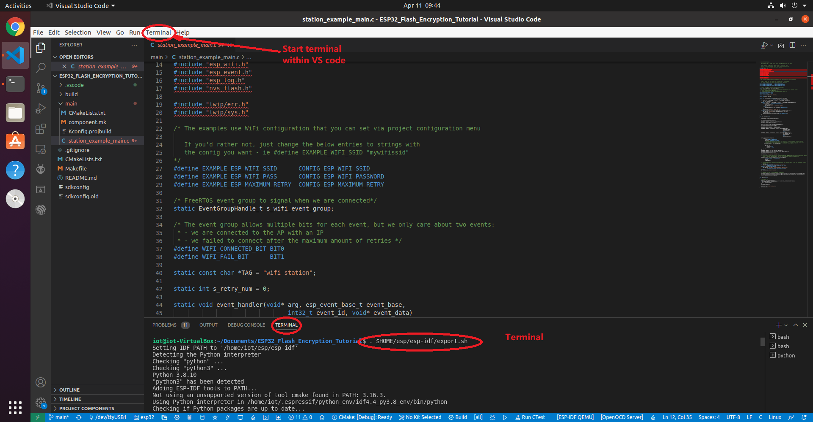

# ESP32 Flash Encryption Tutorial

This project demonstrates how to enable [flash encryption (Development Mode) on the ESP32](https://docs.espressif.com/projects/esp-idf/en/latest/esp32/security/flash-encryption.html). First, we will see how devices without flash encryption are insecure. We will steal the WiFi credentials of a firmware running on the ESP32. Then we will enable flash encryption and show how an attacker cannot steal credentials when flash encryption is enabled. Finally, we will show how the user can upload additional firmware after flash encryption has been enabled, and how flash encryption can be disabled.

## Setup

For this project, we need to use a variety of ESP-IDF tools. For simplicity, we will use the ESP-IDF extension with VS Code and its terminal to use the tools.

### 0. Prerequisite: Install the ESP-IDF extension 
Our new Ubuntu VM is intalled with the ESP-IDF extension. If you do not want to install it yourself, please download it at the specified website.

Otherwise, please follow [this tutorial](https://github.com/espressif/vscode-esp-idf-extension/blob/master/docs/tutorial/install.md) to install it within VS Code.

### 1. Download this repository

After installing ESP-IDF, download this repository into your VM:
```
cd ~/Documents
git clone https://github.com/PBearson/ESP32_Flash_Encryption_Tutorial.git
```

### 2. Load the project into VS Code
Use *File* -> *Open Folder ...* to load the project into VS Code

Please note: this is not a PlatformIO project, but a native ESP-IDF project.
### 3. Start terminal and set up the environment variables

We will start the terminal within VS Code (not the Linux terminal). 



Within the VS Code terminal, set up the environment variables so that we can use all the tools without inputting the full path names.
```
. $HOME/esp/esp-idf/export.sh
```
**All later commands shall be entered in the same terminal**.

### 

## Steal WiFi Credentials in Plaintext Flash

First, we will see how an attacker can steal the credentials from a plaintext firmware.

### 4. Configure the WiFi Application

Within the terminal with the configured environment, navigate to the root directory of this project if needed. Open the project configuration menu:

```
idf.py menuconfig
```

Using the up/down arrow keys, navigate to the `Example Configuration` menu, press _enter_ to enter into the menu, then press _enter_ to begin typing your WiFi SSID. When you are done, do the same for the WiFi Password. After you are done, press _ESC_ several times until you are prompted to save. Press _Y_ to save and exit.

### 5. Upload the Application

Now build, upload, and monitor the app. **NOTE: If using the Hiletgo ESP-WROOM-32 development board, you may need to hold down the IO0 button on the ESP32 when the build system tries to connect to the ESP32's serial port. If you do not hold down the IO0 button during this step, the build system may fail to detect the serial port.**

```
idf.py build flash monitor
```
*CTRL+]* to terminate the serial monitor when needed.

After a few minutes of compiling, the project will be flashed to the board, and the serial terminal will connect to the ESP32. You should see the application successfully connect to your WiFi:


### 6. Steal WiFi Credentials

Now we will atempt to steal the WiFi credentials by reading the flash contents of the ESP32 directly. Download the first 65536 bytes of the firmware from the ESP32 using the following command:

```
esptool.py read_flash 0x10000 0x10000 flash.bin
```

This command reads the contents from the flash chip in the address range 0x10000 - 0x20000. The output is written to the file `flash.bin`.

Now locate the WiFi credentials in the firmware with the following command:

```
strings flash.bin | grep -A1 <SSID>   # Replace <SSID> with your WiFi SSID
```

## Enable Flash Encryption

Now we will enable flash encryption, a security mechanism supported by the ESP32 that defeats attacks like the one demonstrated above. The ESP32 supports two kinds of flash encryption modes: Release, and Development:

* In **Release Mode**, flash encryption is permanently enabled, and the DOWNLOAD_DL_ENCRYPT eFuse is burned. This means the user cannot upload anymore plaintext firmware to the board via UART any more, and the firmware can only be updated via OTA in the release mode.
* In **Development Mode**, flash encryption can be disabled a limited number of times, and the DOWNLOAD_DL_ENCRYPT eFuse is not burned. This allows the user to upload new plaintext firmware.

For this project, we will only use Development Mode.

### 7. Configure the Application

Open the configuration menu again:

```
idf.py menuconfig
```

Navigate to the menu `Security features`. Select the option `Enable flash encryption on boot`. By default, the usage mode should be selected as `Developmeent (NOT SECURE)`. Do not change this setting.

Press ESC and change to the `Partition Table` menu. We need to change the offset of the partition table because the bootloader (which is stored in flash _before_ the partition table) will grow in size. Change the offset of the partition table from 0x8000 to 0x10000.

Press ESC and change to the `Component config` menu. From here, navigate to the `NVS` menu. Disable the option `Enable NVS encryption`, since we are not interested in encrypting the NVS (non-volatile storage) partition.

Do not touch other configurations. Now leave and save the configuration.

### 8. Upload the Application

Build, flash, and monitor the application just as before. Hold down the IO0 button whenever needed.

```
idf.py build flash monitor
```

When the serial terminal connects to the ESP32, you should see that the bootloader, partition table, and firmware are all encrypted. If you see errors, continue to read.


If errors like "*flash read err, 1000*" as follows occur after running *idf.py build flash monitor*, use the following two commands to solve the problems
```
espefuse.py burn_efuse FLASH_CRYPT_CNT
idf.py encrypted-flash
````


## 9. Try to Steal WiFi Credentials

Now we will download the firmware and try to steal the WiFi credentials, just as before. Since we changed the partition table offset, the firmware was actually flashed at offset 0x20000 instead of 0x10000. Therefore, to download the first 65536 bytes of the firmware, use the following command:

```
esptool.py read_flash 0x20000 0x10000 flash_encrypted.bin
```

Now try to read the credentials just like before:

```
strings flash_encrypted.bin | grep -A1 <SSID>   # Replace <SSID> with your WiFi SSID
```

You will see that nothing is returned. This indicates that flash encryption is enabled and the WiFi credentials can no longer be recovered.

## 10. Disable Flash Encryption

To disable flash encryption, please follow the steps below.

**CAUTION: The following procedure can only be performed 3 times, due to the limited size of the FLASH_CRYPT_CNT eFuse.**

First, open the configuration menu, navigate to `Security features`, and disable the option `Enable flash encryption on boot`.

Next, build and flash the application: 

```
idf.py build flash
```

Finally, set the next bit in the FLASH_CRYPT_CNT eFuse to disable flash encryption:

```
espefuse.py burn_efuse FLASH_CRYPT_CNT
````

Follow the instructions and type `BURN` to finish setting the eFuse.


## Notes

### Flash Plaintext Firmware After Flash Encryption is Enabled

As long as the DISABLE_DL_ENCRYPT eFuse remains 0, the user can always upload plaintext firmware to the board, even after flash encryption is enabled. The firmware will be encrypted by the ESP32's UART bootloader when the user uploads new firmware. To upload new firmware after flash encryption is enabled, simply replace all `idf.py flash` commands with `idf.py encrypted-flash`.

### Re-enable Flash Encryption

To re-enable flash encryption, enable the option `Enable flash encryption on boot` in the configuration menu, and build and flash the application. The bootloader will automatically set the next bit in the FLASH_CRYPT_CNT eFuse to enable flash encryption; there is no need for the user to manually burn the efuse.

### Enable Secure Boot After Flash Encryption is Enabled

You can follow [this procedure](https://github.com/PBearson/ESP32_Secure_Boot_Tutorial) to enable secure boot even after flash encryption already enabled. There is no need to disable flash encryption as long as the DOWNLOAD_DL_ENCRYPT eFuse is set to 0.

### espefuse.py
```
espefuse.py summary
```

### Possible failures

[Typical failure cases](https://docs.espressif.com/projects/esp-idf/en/latest/esp32/security/flash-encryption.html#possible-failures)
